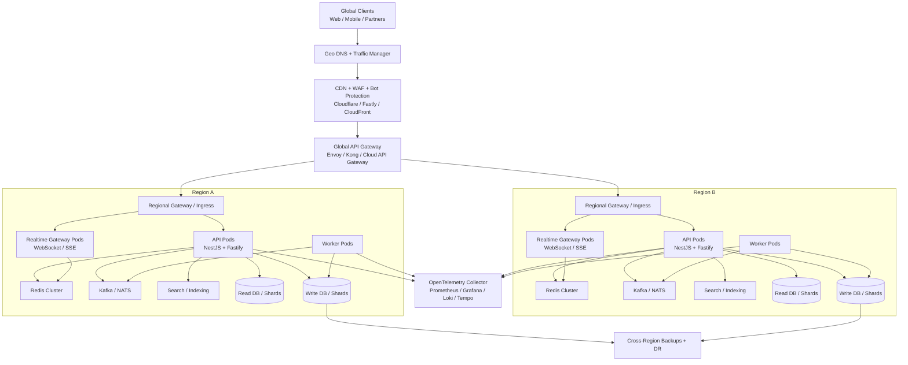

# 10. Hyperscale Global Architecture

## Reality Check

This repository is **not** turned into a literal 100 million concurrent user platform by code changes alone. That target requires a phased migration across infrastructure, data topology, traffic management, observability, and operations. The changes in this pass establish the backend foundations needed to evolve in that direction:

- stateless runtime configuration
- API/worker separation
- cache-aware HTTP responses
- telemetry bootstrap hooks
- container and Kubernetes deployment scaffolding
- repeatable global-read load test assets

The practical goal of this document is to define the architecture, migration path, and code boundaries required to move from the current NestJS monolith into a globally distributed platform.

## Target Architecture

## Recommended Stack

- Edge: Cloudflare or Fastly for CDN, WAF, DDoS mitigation, bot management, geo-routing, and edge caching.
- Gateway: Kong, Envoy Gateway, or managed API Gateway for auth, routing, request normalization, batching, and per-tenant throttles.
- Compute: Kubernetes on EKS, GKE, or AKS with regional clusters and separate node pools for `api`, `realtime`, and `worker`.
- App runtime: NestJS + Fastify for the API edge, with latency-sensitive endpoints kept synchronous and heavy workflows pushed to queues.
- Queue/event backbone: Kafka for durable event streams, or NATS JetStream where lower operational weight is preferred.
- Cache: Redis Cluster for shared cache, distributed locks, rate limiting, session/presence state, and fan-out coordination.
- Database: MySQL-compatible distributed tier for transactional writes plus read replicas and regional followers. Vitess is the practical next step when sharding MySQL.
- Search: OpenSearch or Elasticsearch for listing discovery, faceting, autocomplete, and analytics read models.
- Object storage: S3-compatible storage with CDN fronting for media, exports, and static assets.
- Observability: OpenTelemetry Collector, Prometheus, Grafana, Tempo, and Loki.
- CI/CD: GitHub Actions plus Argo CD or Flux for GitOps-based regional rollouts.

## Backend Refactors Required

### Completed in this pass

- API runtime now exposes stateless deployment controls in [main.ts](/home/achiever/Freelancer/CreatorApp/backend/src/main.ts) and [app.config.ts](/home/achiever/Freelancer/CreatorApp/backend/src/config/app.config.ts).
- Cache-friendly HTTP behavior is centralized in [cache-control.interceptor.ts](/home/achiever/Freelancer/CreatorApp/backend/src/common/interceptors/cache-control.interceptor.ts) with route-level policies from [cache-policy.decorator.ts](/home/achiever/Freelancer/CreatorApp/backend/src/common/decorators/cache-policy.decorator.ts).
- Telemetry bootstrap hooks are wired in [telemetry.ts](/home/achiever/Freelancer/CreatorApp/backend/src/platform/telemetry/telemetry.ts).
- Background work is already separated from request paths via queued registration and the hardened job-locking path in [jobs.service.ts](/home/achiever/Freelancer/CreatorApp/backend/src/modules/jobs/jobs.service.ts) and [jobs.worker.ts](/home/achiever/Freelancer/CreatorApp/backend/src/modules/jobs/jobs.worker.ts).

### Next refactor phases

1. Split process roles.
   - Run independent deployments for `api`, `worker`, and `realtime-gateway`.
   - Remove all in-memory coordination assumptions from request paths.

2. Break the monolith by bounded context.
   - Extract `auth`, `catalog/listings`, `storefront`, `notifications`, and `analytics` behind versioned service contracts.
   - Keep the external API unified through the gateway/BFF layer.

3. Push heavy sync work off the hot path.
   - Registration, search indexing, analytics aggregation, recommendation refresh, notification fan-out, and export generation should be queue-backed.
   - Dashboard snapshots should become precomputed read models, not request-time fan-out queries.

4. Introduce gateway-native request batching.
   - Batch cacheable read endpoints at the API gateway or BFF instead of arbitrary in-app subrequests.
   - Keep mutation paths explicit and idempotent.

5. Move realtime off job polling.
   - Keep SSE for low-frequency notifications.
   - Add dedicated WebSocket gateways for bidirectional realtime traffic, backed by Redis pub/sub or NATS.

## Database Scaling Plan

### Phase 1: Strengthen the current topology

- Keep a single primary for writes.
- Add read replicas for dashboards, catalog reads, and analytics queries.
- Enforce read/write split in Prisma service configuration.
- Add connection pooling via ProxySQL, RDS Proxy, or a managed equivalent.
- Add slow query capture and index tuning for `users`, `listings`, `storefront`, `messages`, and `analytics` tables.

### Phase 2: Shard high-volume domains

- Use Vitess or an equivalent MySQL sharding control plane.
- Shard by stable keys:
  - `users`: `user_id`
  - `listings`: `seller_id` or `storefront_id`
  - `analytics`: time bucket + tenant
- Keep globally unique IDs opaque and non-sequential.
- Route writes through a shard-aware service or gateway tier.

### Phase 3: Regionalize data

- Keep write authority per domain in a designated home region.
- Replicate read models and follower replicas cross-region.
- Serve locality-sensitive reads from the closest region.
- Plan for conflict-free designs only where cross-region writes are unavoidable.

### Indexing and query strategy

- Add compound indexes matching the hottest filters and sort orders.
- Replace broad aggregate fan-out with materialized snapshots.
- Use search infrastructure for faceting and discovery instead of pushing those workloads into MySQL.
- Cache key read models in Redis with explicit TTL and event-driven invalidation.

## Caching Architecture

### Layer 1: Edge cache

- Cache public GET endpoints and media at the CDN.
- Use `Cache-Control` and `Vary` consistently.
- Purge by tag/key on catalog or storefront mutations.

### Layer 2: Application cache

- Redis Cluster for:
  - storefront pages
  - listing cards
  - taxonomy trees
  - dashboard snapshots
  - rate-limit counters
  - idempotency keys
  - realtime presence/state

### Layer 3: Query/read-model cache

- Keep short-lived denormalized read models per dashboard/storefront.
- Rebuild asynchronously from events.
- Never rely on request-time fan-out for global-scale traffic.

## Kubernetes Deployment Strategy

The initial platform manifests are in [infra/k8s/base/kustomization.yaml](/home/achiever/Freelancer/CreatorApp/infra/k8s/base/kustomization.yaml).

- `api` deployment: horizontally scaled Fastify/NestJS pods with HPA and PodDisruptionBudget.
- `worker` deployment: separate pods for async workloads, scaled independently through KEDA.
- Gateway API resource: regional ingress entry point, intended to sit behind a global traffic manager.
- PodMonitor: scrape-ready metrics integration for Prometheus.

Recommended production pattern:

1. One cluster per major geography: Americas, Europe, APAC.
2. Separate node pools for `gateway`, `api`, `realtime`, and `worker`.
3. Regional overlays for image tags, replica floors, hostnames, and region env vars.
4. HPA driven by CPU, memory, and request rate.
5. KEDA for queue depth, lag, or pending-job metrics.
6. Blue/green or canary rollouts controlled by GitOps.

## CI/CD Pipeline Updates

The foundational workflow is in [backend-platform.yml](/home/achiever/Freelancer/CreatorApp/.github/workflows/backend-platform.yml).

- Build and test the backend on every backend/infra change.
- Generate Prisma client before compiling.
- Build the production Docker image.
- Render Kubernetes manifests in CI to catch broken overlays early.

Recommended next CI/CD steps:

- Add image publishing to GHCR or ECR.
- Add SBOM generation and image scanning.
- Add environment promotion workflows with signed image tags.
- Deploy via Argo CD or Flux with progressive rollouts.
- Gate promotion on p95/p99 latency, error budget, and queue lag thresholds.

## Load Testing Strategy

### Assets included now

- Existing Node-based load runner: [load-test.mjs](/home/achiever/Freelancer/CreatorApp/backend/scripts/load-test.mjs)
- k6 global-read scenario: [k6-global-read.js](/home/achiever/Freelancer/CreatorApp/backend/loadtest/k6-global-read.js)
- Locust scenario: [locust-global.py](/home/achiever/Freelancer/CreatorApp/backend/loadtest/locust-global.py)

### Test progression

1. Service-level tests
   - Target a single regional API deployment.
   - Measure p50/p95/p99 latency, error rate, saturation, and DB/Redis pressure.

2. Regional scale tests
   - Ramp catalog/storefront reads, auth bursts, queue fan-out, and realtime connection counts independently.
   - Verify autoscaling response time and cache hit ratios.

3. Multi-region failover tests
   - Remove one region from rotation.
   - Verify traffic drains, queue recovery, and replica promotion behavior.

4. Soak and chaos tests
   - Run 12-24 hour sustained traffic.
   - Inject Redis loss, replica lag, worker crashes, and gateway failure scenarios.

### Important constraint

Do not jump from local load tests to a “100 million concurrent users” claim. The correct path is:

- prove hundreds
- prove thousands
- prove tens of thousands per region
- validate regional failover
- only then project global concurrency

## Migration Roadmap

1. Finish hot-path cleanup in the monolith.
   - paginate heavy reads
   - precompute dashboard summaries
   - move all expensive side effects to queues

2. Stand up regional Kubernetes and Redis/MySQL topology.

3. Introduce Kafka or NATS for durable eventing and independent worker scaling.

4. Extract auth, notifications, analytics, and search-backed discovery into deployable services.

5. Add dedicated realtime gateways and regional pub/sub.

6. Add global traffic management, edge purge flows, DR drills, and error-budget-driven deployment gates.

## Bottom Line

This codebase can be pushed toward hyperscale, but not by treating the current NestJS app as a single giant API that magically scales to 100 million concurrent users. The correct architecture is a globally distributed platform with:

- stateless API pods
- independent workers
- distributed cache
- shard-aware data services
- queue-driven side effects
- regional deployment and failover
- strong observability and traffic controls

The changes in this pass establish that first platform layer. The remaining work is infrastructure-heavy and should be executed in phases with measured load targets.
